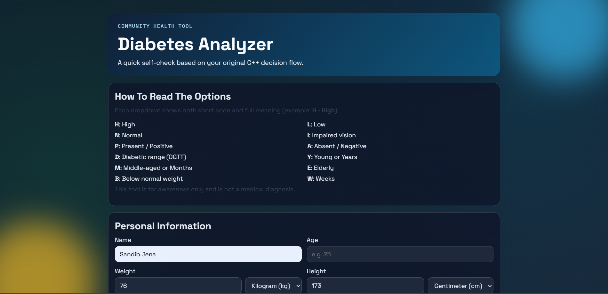
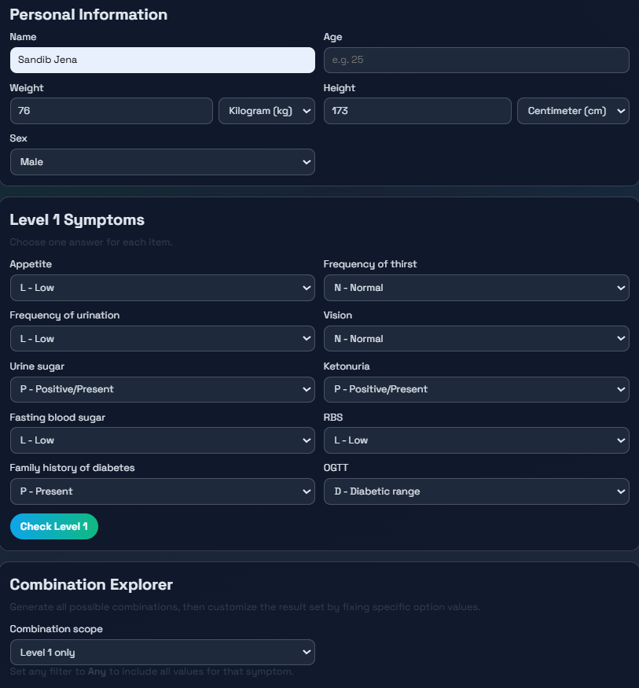
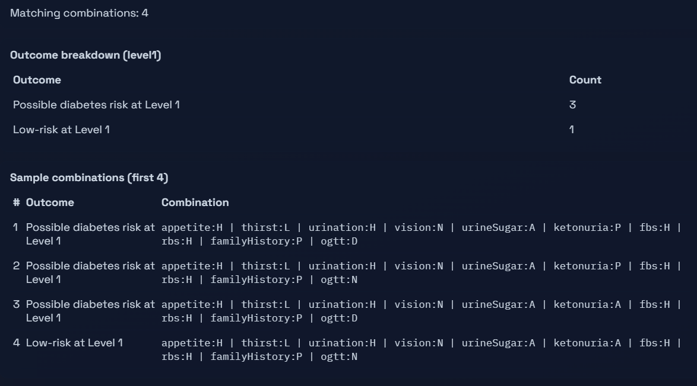

# Diabetes Analyzer

A hybrid C++ and web-based diabetes risk screening tool that analyzes symptom patterns through a structured 3-level decision system.

🔗 Live Demo: https://glucowatch.vercel.app/web/index.html  
📦 GitHub Repository: https://github.com/SandibJena/Diabetes_Analyzer.git


## Project Structure

project-root
│
├── src
│ └── cpp
│ └── Diabetes_Analyzer.cpp
│
├── web
│ ├── index.html
│ ├── script.js
│ └── styles.css
│
├── docs
│ ├── image
│ │ ├── home.png
│ │ ├── input.png
│ │ └── result.png
│ └── CHANGELOG.md
│
└── .github


## Screenshots

### Home Interface


### Input Interface


### Risk Analysis Result



## Tech Stack

Frontend:
- HTML5
- CSS3
- JavaScript

Backend / Logic:
- C++ (core screening algorithm)

Deployment:
- Vercel

Version Control:
- Git & GitHub


## Screening Algorithm

The analyzer uses a 3-level decision flow:

1️⃣ Level 1 – Risk Detection  
Identifies general symptom combinations associated with diabetes risk.

2️⃣ Level 2 – Pattern Classification  
Distinguishes between primary and secondary symptom patterns.

3️⃣ Level 3 – Diabetes Orientation  
Provides an indication of insulin-dependent or non-insulin-dependent patterns.


## Prerequisites

- Python 3.x (for running local web server)
- g++ compiler supporting C++17
- Modern web browser


## Run Locally

### Web App

From the project folder, start a static server:

```powershell
python -m http.server 5500
```

Open:

`http://127.0.0.1:5500/web/index.html`

### C++ Console App

Compile (example with `g++`):

```powershell
g++ -std=c++17 -O2 -o Diabetes_Analyzer.exe src/cpp/Diabetes_Analyzer.cpp
```

Run:

```powershell
.\Diabetes_Analyzer.exe
```


## Future Improvements

- Add machine learning model for prediction
- Store historical screening results
- User authentication system
- Mobile responsive UI


## Contributing

Contributions are welcome.

1. Fork the repository
2. Create a feature branch
3. Commit changes
4. Submit a Pull Request

[](https://glucowatch.vercel.app/web/index.html)


## Important Disclaimer

Results are approximate and depend on user-provided inputs. Always consult a qualified medical professional for accurate diagnosis and treatment decisions.


## License

This project is licensed under the MIT License. See `LICENSE`.


